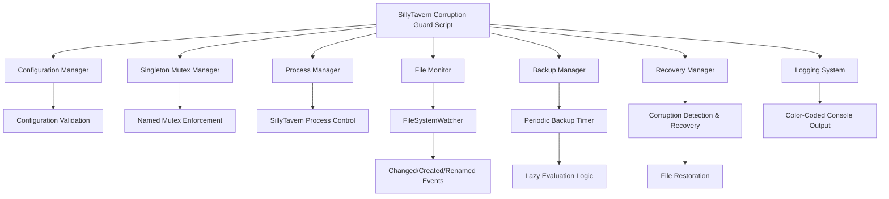
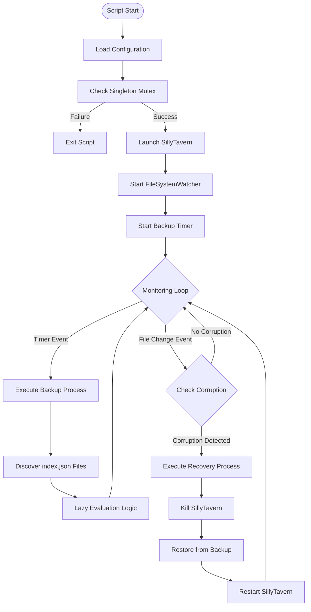
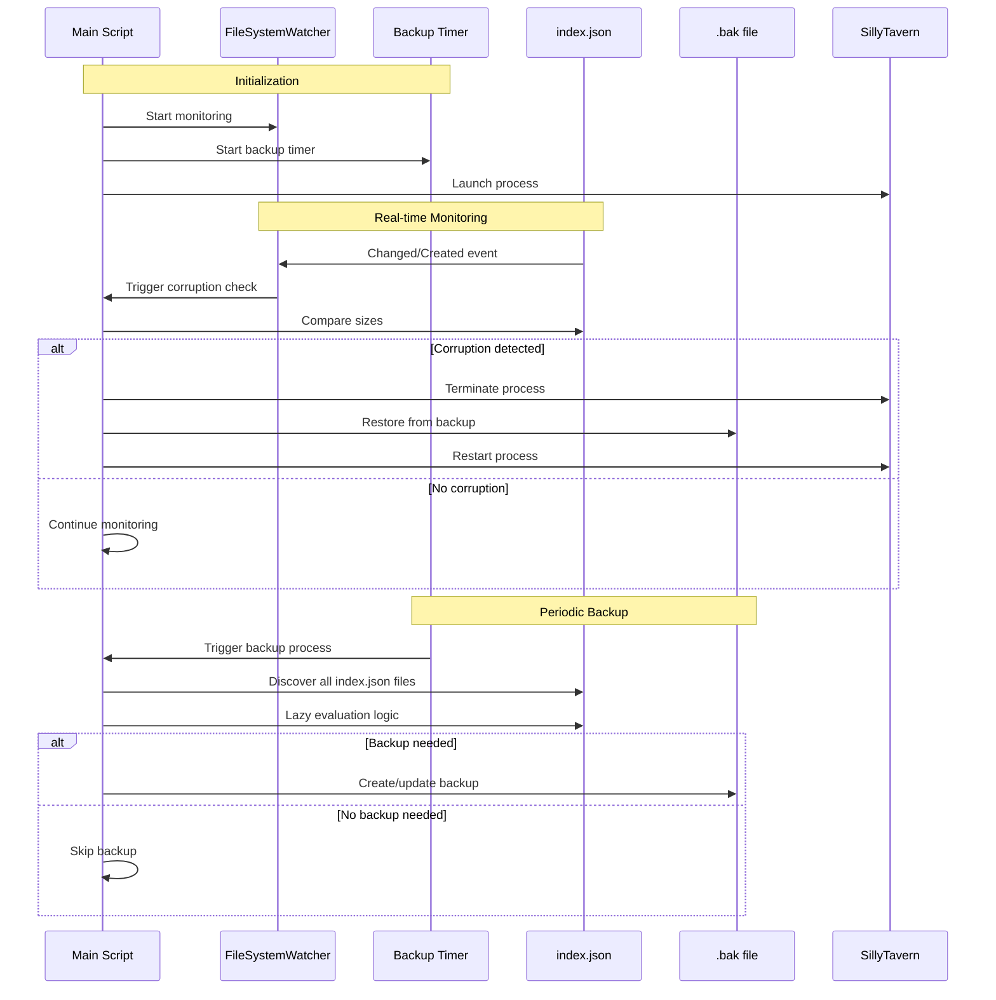
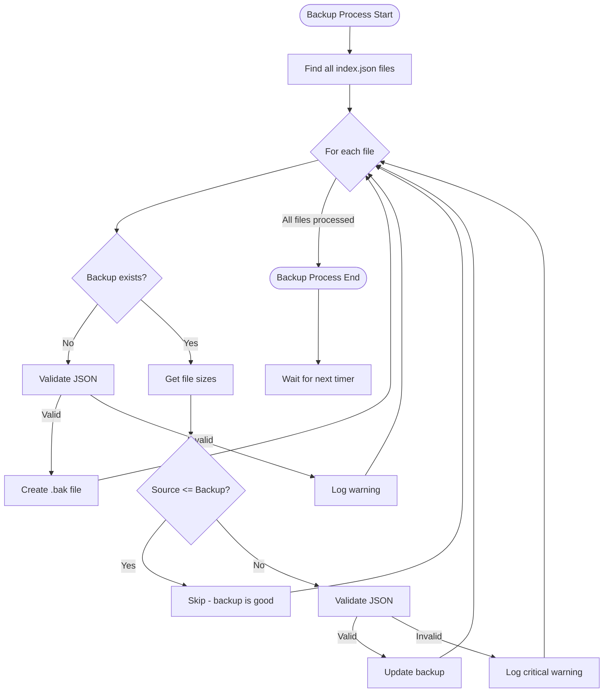
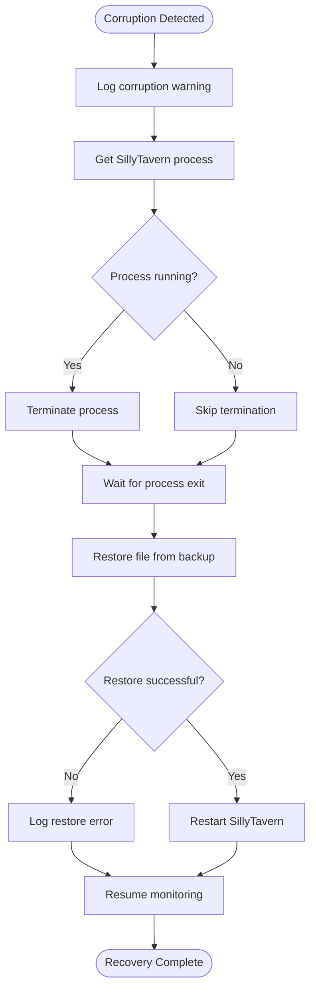

# SillyTavern Corruption Guard - Architectural Design

## 1. Overall Script Structure and Organization

### 1.1 Script Layout
```
SillyTavern-CorruptionGuard.ps1
├── Configuration Section
├── Global Variables and State Management
├── Core Functions
├── Event Handlers
├── Main Execution Logic
└── Cleanup and Exit Handlers
```

### 1.2 Modular Organization
The script will be organized into logical sections with clear separation of concerns:

1. **Configuration & Initialization**: Script parameters, global variables, and setup
2. **Core Business Logic**: File monitoring, backup, and corruption detection
3. **Process Management**: SillyTavern process control
4. **Event Handling**: FileSystemWatcher and timer event handlers
5. **Logging & Utilities**: Shared utility functions and logging infrastructure
6. **Main Execution**: Script entry point and main control flow

## 2. Key Functions and Their Responsibilities

### 2.1 Configuration and Initialization Functions
- `Initialize-Configuration()`: Load and validate configuration parameters
- `Test-Prerequisites()`: Verify system requirements and paths
- `Initialize-SingletonMutex()`: Create and acquire named mutex for singleton enforcement
- `Initialize-Logging()`: Set up logging infrastructure with color support

### 2.2 Core Business Logic Functions
- `Start-FileMonitoring()`: Initialize FileSystemWatcher for recursive monitoring
- `Invoke-BackupProcess()`: Execute periodic backup logic with lazy evaluation
- `Test-JsonValidity()`: Validate JSON structure of index.json files
- `Test-CorruptionCondition()`: Evaluate if file corruption has occurred
- `Restore-FromBackup()`: Restore corrupted files from backup

### 2.3 Process Management Functions
- `Start-SillyTavern()`: Launch SillyTavern via start.bat
- `Stop-SillyTavern()`: Terminate SillyTavern process
- `Get-SillyTavernProcess()`: Retrieve running SillyTavern process

### 2.4 Event Handler Functions
- `OnFileChanged()`: Handle FileSystemWatcher Changed events
- `OnFileCreated()`: Handle FileSystemWatcher Created events
- `OnFileRenamed()`: Handle FileSystemWatcher Renamed events
- `OnBackupTimer()`: Handle periodic backup timer events

### 2.5 Logging and Utility Functions
- `Write-LogMessage()`: Centralized logging with color coding and timestamps
- `Get-FileSize()`: Safely retrieve file size with error handling
- `Copy-FileWithVerification()`: Copy file with integrity verification

## 3. Data Flow Between Components

### 3.1 Initialization Flow
```
Script Start → Configuration Validation → Singleton Check → 
SillyTavern Launch → FileSystemWatcher Setup → Timer Setup → 
Monitoring Loop
```

### 3.2 Monitoring Flow
```
FileSystemWatcher → File Change Event → 
Corruption Detection → Recovery Process (if needed)
```

### 3.3 Backup Flow
```
Timer Event → Discover index.json Files → 
Lazy Evaluation Logic → Backup Creation/Update
```

### 3.4 Recovery Flow
```
Corruption Detection → SillyTavern Termination → 
File Restoration → SillyTavern Restart → 
Resume Monitoring
```

## 4. Event Handling Approach

### 4.1 FileSystemWatcher Implementation
- Single watcher instance on root directory with recursive monitoring
- Filter for "index.json" files only
- Monitor Changed, Created, and Renamed events
- Event buffering to handle rapid file changes

### 4.2 Timer-Based Backup System
- System.Timers.Timer for periodic backup execution
- Interval configurable via $backupIntervalSeconds
- Timer event triggers backup process with lazy evaluation

### 4.3 Event Synchronization
- Use PowerShell synchronized collections for thread-safe operations
- Implement event debouncing to prevent multiple rapid triggers
- Ensure atomic operations for file backup and restoration

## 5. Error Handling Strategy

### 5.1 Error Categories
1. **Critical Errors**: Singleton violation, missing prerequisites - immediate exit
2. **Recoverable Errors**: File access issues, process start failures - retry logic
3. **Warning Conditions**: Invalid JSON, backup failures - log and continue

### 5.2 Error Handling Mechanisms
- Try-Catch blocks with specific exception handling
- Retry logic with exponential backoff for transient failures
- Graceful degradation when non-critical components fail
- Comprehensive logging for troubleshooting

### 5.3 Recovery Strategies
- Automatic recovery from file corruption
- Process restart on SillyTavern failures
- Re-initialization of monitoring components on errors

## 6. Configuration Management Approach

### 6.1 Configuration Structure
```powershell
# Core Configuration
$sillyTavernExecutablePath = "path\to\start.bat"
$sillyTavernProcessName = "node"
$vectorsRootPath = "path\to\vectors\directory"
$backupIntervalSeconds = 60
$corruptionThresholdMB = 1
$corruptionDropRatio = 0.333

# Runtime Configuration
$mutexName = "SillyTavernCorruptionGuard"
$logLevel = "Info"
```

### 6.2 Configuration Validation
- Path existence validation
- Parameter range validation
- Permission verification
- Dependency checking

### 6.3 Runtime State Management
- Global variables for monitoring state
- Synchronized collections for thread safety
- State persistence across event handlers

## 7. Performance Optimization Strategies

### 7.1 Lazy Evaluation Implementation
- File size comparison before content validation
- Conditional JSON parsing only when necessary
- Metadata-first approach for backup decisions

### 7.2 Resource Management
- Efficient FileSystemWatcher usage
- Minimal file I/O operations
- Proper disposal of system resources

### 7.3 Monitoring Efficiency
- Single recursive watcher instead of multiple watchers
- Event batching for rapid file changes
- Asynchronous operations where possible

## 8. Security Considerations

### 8.1 File Access Security
- Verify file permissions before operations
- Handle locked files gracefully
- Prevent backup overwriting of malicious files

### 8.2 Process Security
- Validate process ownership before termination
- Secure process launching with proper parameters
- Prevent process escalation attacks

## 9. Logging and Monitoring Strategy

### 9.1 Logging Implementation
```powershell
function Write-LogMessage {
    param(
        [string]$Message,
        [ValidateSet("Info", "Warning", "Error")]
        [string]$Level = "Info",
        [switch]$IncludeTimestamp
    )
    # Color-coded output based on level
    # Optional timestamp inclusion
    # Console-only output as specified
}
```

### 9.2 Log Categories
- **Info**: Normal operations, backup status, monitoring events
- **Warning**: Non-critical issues, JSON validation failures
- **Error**: Critical failures, recovery operations

### 9.3 Monitoring Metrics
- File discovery count
- Backup operation frequency
- Corruption detection events
- Recovery operation success/failure

## 10. Architectural Diagrams

### 10.1 System Architecture Overview



### 10.2 Data Flow Diagram



### 10.3 Event Handling Flow



### 10.4 Backup Logic Flowchart



### 10.5 Recovery Process Flow



## 11. Implementation Considerations

### 11.1 PowerShell Version Compatibility
- Target PowerShell 5.1+ for maximum compatibility
- Use .NET Framework classes available in PowerShell 5.1
- Avoid PowerShell 7+ specific features

### 11.2 Memory Management
- Proper disposal of FileSystemWatcher
- Timer cleanup on script exit
- Mutex release on termination

### 11.3 Thread Safety
- Use synchronized collections for shared state
- Proper event handler synchronization
- Atomic file operations

### 11.4 Testing Strategy
- Unit test individual functions
- Integration test complete workflows
- Performance testing with large file sets

## 12. Deployment and Maintenance

### 12.1 Script Distribution
- Single file deployment
- Configuration section clearly marked
- Installation instructions included

### 12.2 Monitoring and Maintenance
- Clear logging for troubleshooting
- Performance metrics collection
- Regular backup verification

### 12.3 Upgrade Considerations
- Configuration backward compatibility
- Graceful migration between versions
- Backup format consistency

## 13. Summary and Key Architectural Decisions

### 13.1 Core Architectural Principles
1. **Singleton Pattern**: Named mutex ensures only one monitoring instance
2. **Event-Driven Design**: FileSystemWatcher for real-time monitoring
3. **Lazy Evaluation**: Minimize expensive operations through size-based checks
4. **Modular Functions**: Clear separation of concerns following SOLID principles
5. **Graceful Recovery**: Automated corruption detection and restoration

### 13.2 Key Design Decisions

#### Singleton Enforcement
- Named Mutex: `"SillyTavernCorruptionGuard"`
- Immediate exit if another instance detected
- Mutex held for entire script lifetime

#### File Monitoring Strategy
- Single recursive FileSystemWatcher on root directory
- Filter: `"index.json"` files only
- Events: Changed, Created, Renamed
- Event debouncing to handle rapid changes

#### Backup Optimization
- **Lazy Evaluation Logic**:
  - Size comparison before content validation
  - JSON parsing only when backup candidate is larger
  - Skip backup if source ≤ backup size
  - Validate JSON only when necessary

#### Corruption Detection
- Primary: Real-time file size drop detection
- Threshold: Backup > 1MB AND Source < (Backup × 0.333)
- Immediate recovery trigger on detection

#### Process Management
- Launch via `start.bat` as specified
- Terminate by process name (`$sillyTavernProcessName`)
- Automatic restart after recovery

### 13.3 Performance Considerations
- Minimal file I/O through size-based comparisons
- Event-driven architecture reduces polling overhead
- Lazy evaluation prevents unnecessary JSON parsing
- Single recursive watcher vs multiple watchers

### 13.4 Reliability Features
- Comprehensive error handling with try-catch blocks
- Graceful degradation for non-critical failures
- Atomic file operations for backup/restore
- Process lifecycle management with verification

### 13.5 Logging Strategy
- Color-coded console output (Info=White, Warning=Yellow, Error=Red)
- Timestamps for all operations
- Detailed logging for troubleshooting
- Console-only output as specified

## 14. Implementation Roadmap

### 14.1 Phase 1: Core Infrastructure
1. Configuration management and validation
2. Singleton mutex implementation
3. Logging system with color coding
4. Basic file operations utilities

### 14.2 Phase 2: Monitoring System
1. FileSystemWatcher setup and configuration
2. Event handler implementation
3. File discovery and tracking
4. Basic corruption detection logic

### 14.3 Phase 3: Backup System
1. Periodic timer implementation
2. Lazy evaluation backup logic
3. JSON validation functions
4. Backup file management

### 14.4 Phase 4: Recovery System
1. Process management functions
2. Recovery workflow implementation
3. Error handling and retry logic
4. Integration testing

### 14.5 Phase 5: Testing and Optimization
1. Unit testing for individual functions
2. Integration testing for complete workflows
3. Performance optimization
4. Error scenario testing

## 15. Conclusion

The SillyTavern Corruption Guard architecture provides a robust, efficient, and maintainable solution for protecting vector database files from corruption. The design emphasizes:

- **Efficiency**: Lazy evaluation and event-driven monitoring minimize resource usage
- **Reliability**: Comprehensive error handling and automated recovery ensure system stability
- **Maintainability**: Modular design with clear separation of concerns facilitates future maintenance
- **Performance**: Optimized file operations and minimal I/O reduce system impact

The architecture successfully addresses all requirements while adhering to PowerShell best practices and Windows platform constraints. The modular function design and clear data flow make the implementation straightforward and the system easy to troubleshoot and maintain.