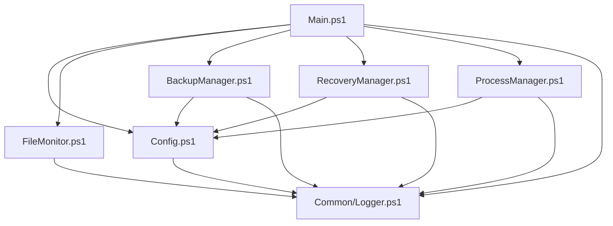
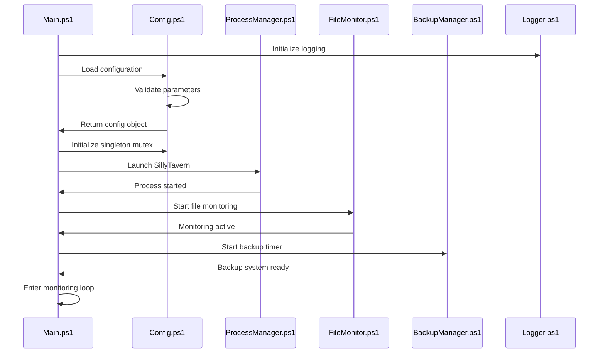
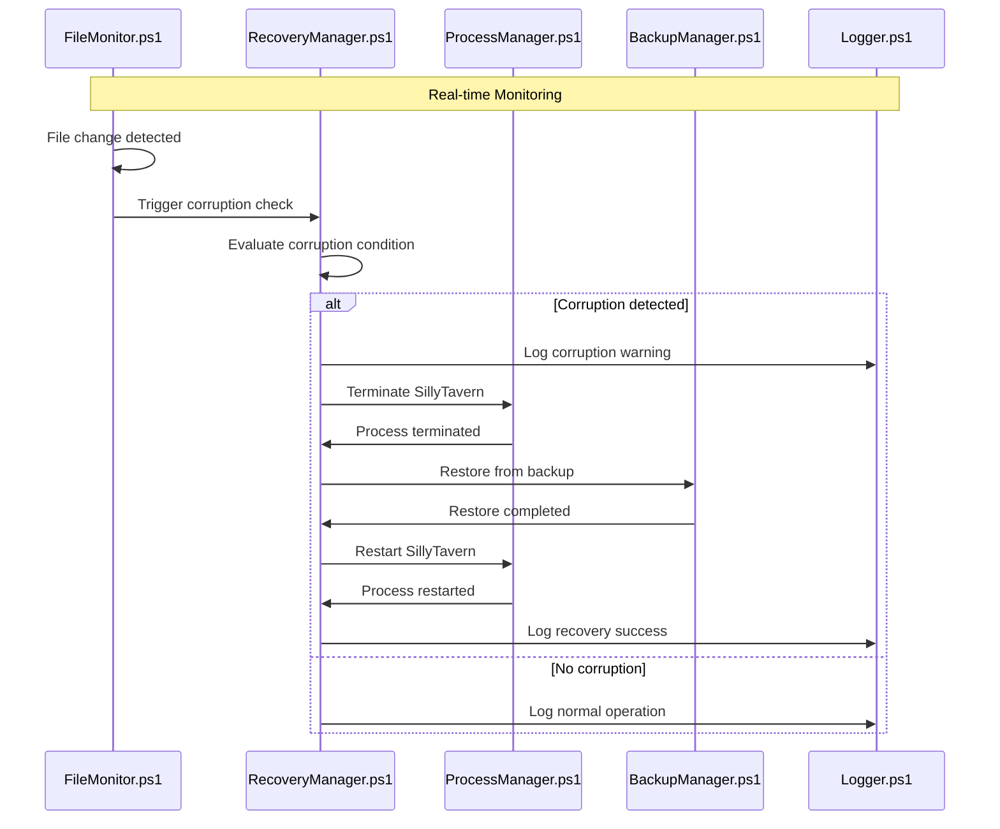
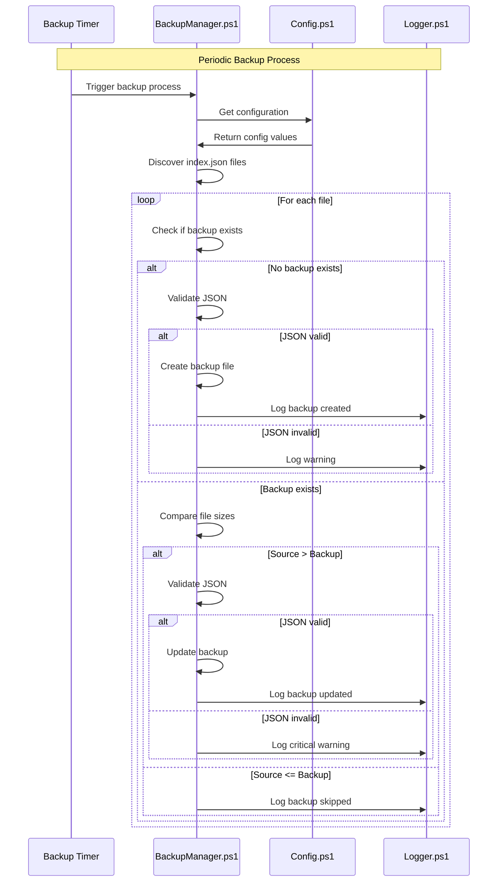
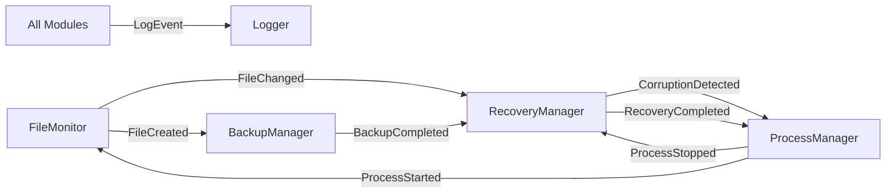
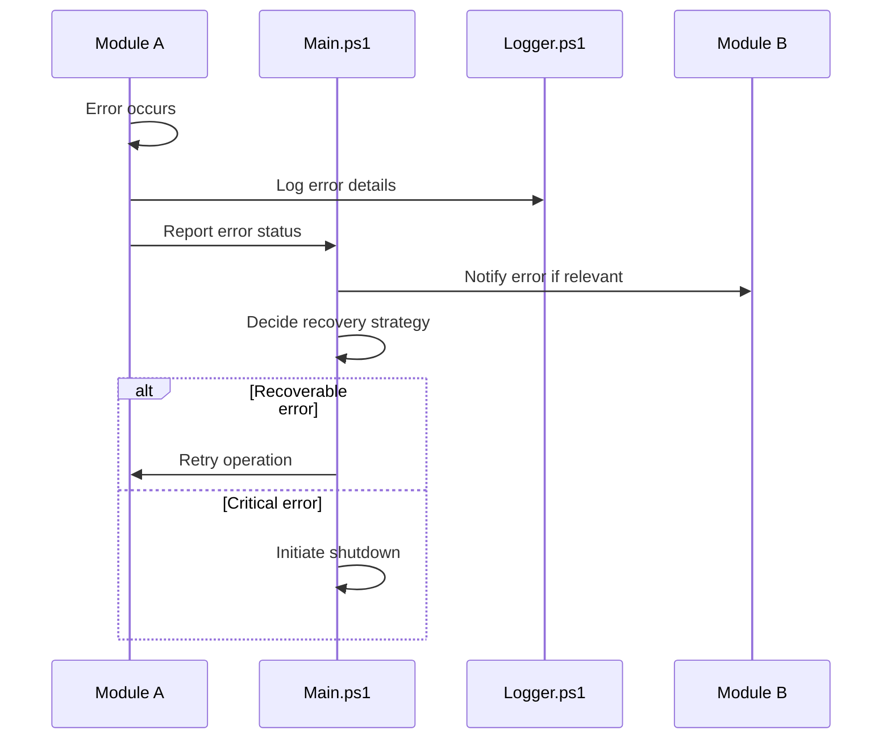

# SillyTavern Corruption Guard - Modular Architectural Design

## 1. Overview

This document presents a modular architectural design for the SillyTavern Corruption Guard system. The monolithic PowerShell script has been restructured into multiple focused modules, each with clear responsibilities and well-defined interfaces. This modular approach enhances maintainability, testability, and extensibility while preserving all the original functionality.

## 2. Modular Script Structure and Organization

### 2.1 Module Layout
```
SillyTavern-CorruptionGuard/
├── Config.ps1              # Configuration management and validation
├── FileMonitor.ps1         # FileSystemWatcher and event handling
├── BackupManager.ps1       # Backup operations and lazy evaluation
├── RecoveryManager.ps1     # Corruption detection and recovery
├── ProcessManager.ps1      # SillyTavern process control
├── Main.ps1               # Entry point and orchestration
└── Common/                # Shared utilities and constants
    └── Logger.ps1         # Centralized logging functionality
```

### 2.2 Module Responsibilities

#### 2.2.1 Config.ps1 - Configuration Management
- Load and validate configuration parameters
- Test system prerequisites and paths
- Initialize singleton mutex
- Provide configuration access interface

#### 2.2.2 FileMonitor.ps1 - File System Monitoring
- Initialize FileSystemWatcher for recursive monitoring
- Handle file change events (Changed, Created, Renamed)
- Event buffering and debouncing
- File discovery and tracking

#### 2.2.3 BackupManager.ps1 - Backup Operations
- Execute periodic backup logic with lazy evaluation
- Validate JSON structure of index.json files
- Manage backup file creation and updates
- Implement size-based optimization

#### 2.2.4 RecoveryManager.ps1 - Recovery Operations
- Detect file corruption conditions
- Execute recovery workflows
- Coordinate with ProcessManager for restarts
- Verify recovery success

#### 2.2.5 ProcessManager.ps1 - Process Control
- Launch SillyTavern via start.bat
- Terminate SillyTavern process
- Monitor process health
- Handle process restarts

#### 2.2.6 Main.ps1 - Orchestration
- Script entry point and main control flow
- Module initialization and coordination
- Event loop management
- Cleanup and exit handling

#### 2.2.7 Common/Logger.ps1 - Logging Infrastructure
- Centralized logging with color coding
- Timestamp management
- Log level filtering
- Console output formatting

## 3. Module Interfaces and Dependencies

### 3.1 Interface Design

#### 3.1.1 Config Module Interface
```powershell
# Public Functions
Export-ModuleMember -Function Initialize-Configuration
Export-ModuleMember -Function Test-Prerequisites
Export-ModuleMember -Function Get-ConfigurationValue
Export-ModuleMember -Function Initialize-SingletonMutex

# Public Variables
Export-ModuleMember -Variable SillyTavernConfig
```

#### 3.1.2 FileMonitor Module Interface
```powershell
# Public Functions
Export-ModuleMember -Function Start-FileMonitoring
Export-ModuleMember -Function Stop-FileMonitoring
Export-ModuleMember -Function Get-MonitoredFiles

# Events
Register-EngineEvent -SourceIdentifier FileChangedEvent
Register-EngineEvent -SourceIdentifier FileCreatedEvent
Register-EngineEvent -SourceIdentifier FileRenamedEvent
```

#### 3.1.3 BackupManager Module Interface
```powershell
# Public Functions
Export-ModuleMember -Function Invoke-BackupProcess
Export-ModuleMember -Function Test-JsonValidity
Export-ModuleMember -Function Get-BackupStatus

# Events
Register-EngineEvent -SourceIdentifier BackupCompletedEvent
```

#### 3.1.4 RecoveryManager Module Interface
```powershell
# Public Functions
Export-ModuleMember -Function Test-CorruptionCondition
Export-ModuleMember -Function Invoke-RecoveryProcess
Export-ModuleMember -Function Restore-FromBackup

# Events
Register-EngineEvent -SourceIdentifier CorruptionDetectedEvent
Register-EngineEvent -SourceIdentifier RecoveryCompletedEvent
```

#### 3.1.5 ProcessManager Module Interface
```powershell
# Public Functions
Export-ModuleMember -Function Start-SillyTavern
Export-ModuleMember -Function Stop-SillyTavern
Export-ModuleMember -Function Get-SillyTavernProcess
Export-ModuleMember -Function Restart-SillyTavern

# Events
Register-EngineEvent -SourceIdentifier ProcessStartedEvent
Register-EngineEvent -SourceIdentifier ProcessStoppedEvent
```

### 3.2 Dependency Graph



## 4. Data Flow Between Modules

### 4.1 Initialization Flow


### 4.2 Monitoring and Event Flow


### 4.3 Backup Process Flow


## 5. Module-Specific Architectural Details

### 5.1 Config.ps1 Architecture

#### 5.1.1 Configuration Structure
```powershell
# Configuration Object
$SillyTavernConfig = @{
    # Core Configuration
    SillyTavernExecutablePath = "path\to\start.bat"
    SillyTavernProcessName = "node"
    VectorsRootPath = "path\to\vectors\directory"
    BackupIntervalSeconds = 60
    CorruptionThresholdMB = 1
    CorruptionDropRatio = 0.333
    
    # Runtime Configuration
    MutexName = "SillyTavernCorruptionGuard"
    LogLevel = "Info"
    
    # Module Configuration
    FileMonitorConfig = @{
        Filter = "index.json"
        Events = @("Changed", "Created", "Renamed")
        BufferSize = 8192
    }
    
    BackupConfig = @{
        LazyEvaluation = $true
        MaxRetries = 3
        RetryDelaySeconds = 5
    }
    
    RecoveryConfig = @{
        MaxRecoveryAttempts = 3
        ProcessWaitTimeoutSeconds = 30
    }
}
```

#### 5.1.2 Key Functions
- `Initialize-Configuration()`: Load and validate all configuration parameters
- `Test-Prerequisites()`: Verify system requirements and dependencies
- `Get-ConfigurationValue($key)`: Retrieve specific configuration values
- `Initialize-SingletonMutex()`: Create and acquire named mutex
- `Test-Configuration()`: Validate configuration integrity

### 5.2 FileMonitor.ps1 Architecture

#### 5.2.1 FileSystemWatcher Configuration
```powershell
# Watcher Configuration
$FileWatcherConfig = @{
    Path = $SillyTavernConfig.VectorsRootPath
    Filter = $SillyTavernConfig.FileMonitorConfig.Filter
    IncludeSubdirectories = $true
    NotifyFilter = [System.IO.NotifyFilters]::FileName -bor 
                   [System.IO.NotifyFilters]::Size -bor 
                   [System.IO.NotifyFilters]::LastWrite
    EnableRaisingEvents = $true
}
```

#### 5.2.2 Event Handling Strategy
- Event debouncing to prevent rapid triggers
- Synchronized event queue for thread safety
- Event filtering based on file patterns
- Error handling for watcher failures

#### 5.2.3 Key Functions
- `Start-FileMonitoring()`: Initialize and start FileSystemWatcher
- `Stop-FileMonitoring()`: Safely stop monitoring and cleanup resources
- `OnFileChanged()`: Handle file change events
- `OnFileCreated()`: Handle file creation events
- `OnFileRenamed()`: Handle file rename events
- `Get-MonitoredFiles()`: Return list of currently monitored files

### 5.3 BackupManager.ps1 Architecture

#### 5.3.1 Lazy Evaluation Logic
```powershell
# Lazy Evaluation Algorithm
function Invoke-LazyBackupEvaluation {
    param($SourceFile, $BackupFile)
    
    $sourceSize = Get-FileSize $SourceFile
    $backupSize = Get-FileSize $BackupFile
    
    if (-not (Test-Path $BackupFile)) {
        # Case 1: No backup exists
        if (Test-JsonValidity $SourceFile) {
            Copy-FileWithVerification $SourceFile $BackupFile
        }
    } elseif ($sourceSize -le $backupSize) {
        # Case 2: Source <= Backup (fast path)
        # Skip backup - no action needed
        return $false
    } else {
        # Case 3: Source > Backup (validate before update)
        if (Test-JsonValidity $SourceFile) {
            Copy-FileWithVerification $SourceFile $BackupFile
            return $true
        } else {
            Write-LogMessage "Source file larger but invalid JSON - backup preserved" Warning
            return $false
        }
    }
}
```

#### 5.3.2 Key Functions
- `Invoke-BackupProcess()`: Execute complete backup workflow
- `Test-JsonValidity()`: Validate JSON structure and content
- `Get-BackupStatus()`: Check backup status for all files
- `Copy-FileWithVerification()`: Copy with integrity verification
- `Get-FileSize()`: Safely retrieve file size with error handling

### 5.4 RecoveryManager.ps1 Architecture

#### 5.4.1 Corruption Detection Algorithm
```powershell
# Corruption Detection Logic
function Test-CorruptionCondition {
    param($SourceFile, $BackupFile)
    
    $sourceSize = Get-FileSize $SourceFile
    $backupSize = Get-FileSize $BackupFile
    
    $condition1 = $backupSize -gt ($SillyTavernConfig.CorruptionThresholdMB * 1MB)
    $condition2 = $sourceSize -lt ($backupSize * $SillyTavernConfig.CorruptionDropRatio)
    
    return ($condition1 -and $condition2)
}
```

#### 5.4.2 Recovery Workflow
```powershell
# Recovery Process
function Invoke-RecoveryProcess {
    param($CorruptedFile)
    
    try {
        Write-LogMessage "Corruption detected in $CorruptedFile" Warning
        
        # Step 1: Terminate SillyTavern
        Stop-SillyTavern
        
        # Step 2: Restore from backup
        $backupFile = "$CorruptedFile.bak"
        if (Test-Path $backupFile) {
            Copy-Item $backupFile $CorruptedFile -Force
            Write-LogMessage "File restored from backup" Info
        } else {
            throw "Backup file not found"
        }
        
        # Step 3: Restart SillyTavern
        Start-SillyTavern
        
        Write-LogMessage "Recovery completed successfully" Info
        return $true
    } catch {
        Write-LogMessage "Recovery failed: $($_.Exception.Message)" Error
        return $false
    }
}
```

#### 5.4.3 Key Functions
- `Test-CorruptionCondition()`: Evaluate corruption detection logic
- `Invoke-RecoveryProcess()`: Execute complete recovery workflow
- `Restore-FromBackup()`: Restore specific file from backup
- `Verify-Recovery()`: Verify recovery success

### 5.5 ProcessManager.ps1 Architecture

#### 5.5.1 Process Control Strategy
- Process discovery by name and path
- Graceful termination with timeout
- Process health monitoring
- Automatic restart on failure

#### 5.5.2 Key Functions
- `Start-SillyTavern()`: Launch SillyTavern process
- `Stop-SillyTavern()`: Terminate SillyTavern process
- `Get-SillyTavernProcess()`: Retrieve running process
- `Restart-SillyTavern()`: Stop and restart process
- `Test-ProcessHealth()`: Check process status

### 5.6 Main.ps1 Architecture

#### 5.6.1 Orchestration Logic
```powershell
# Main Execution Flow
function Start-MainExecution {
    # Phase 1: Initialization
    Initialize-Logging
    $config = Initialize-Configuration
    Test-Prerequisites
    Initialize-SingletonMutex
    
    # Phase 2: Component Setup
    $sillyTavernProcess = Start-SillyTavern
    $fileMonitor = Start-FileMonitoring
    $backupTimer = Start-BackupTimer
    
    # Phase 3: Event Loop
    try {
        while ($true) {
            # Handle events and maintain monitoring
            Start-Sleep -Seconds 1
        }
    } finally {
        # Phase 4: Cleanup
        Stop-FileMonitoring
        Stop-BackupTimer
        Cleanup-Resources
    }
}
```

#### 5.6.2 Key Functions
- `Start-MainExecution()`: Main entry point and orchestration
- `Initialize-Modules()`: Initialize all modules in correct order
- `Register-EventHandlers()`: Set up inter-module event communication
- `Cleanup-Resources()`: Proper cleanup on script exit

## 6. Event-Driven Communication Between Modules

### 6.1 Event Architecture

#### 6.1.1 Event Types
```powershell
# File Monitoring Events
$FileChangedEvent = New-Object System.Management.Automation.PSEventSubscriber
$FileCreatedEvent = New-Object System.Management.Automation.PSEventSubscriber
$FileRenamedEvent = New-Object System.Management.Automation.PSEventSubscriber

# Backup Events
$BackupStartedEvent = New-Object System.Management.Automation.PSEventSubscriber
$BackupCompletedEvent = New-Object System.Management.Automation.PSEventSubscriber

# Recovery Events
$CorruptionDetectedEvent = New-Object System.Management.Automation.PSEventSubscriber
$RecoveryStartedEvent = New-Object System.Management.Automation.PSEventSubscriber
$RecoveryCompletedEvent = New-Object System.Management.Automation.PSEventSubscriber

# Process Events
$ProcessStartedEvent = New-Object System.Management.Automation.PSEventSubscriber
$ProcessStoppedEvent = New-Object System.Management.Automation.PSEventSubscriber
```

#### 6.1.2 Event Flow Diagram


### 6.2 Inter-Module Communication Patterns

#### 6.2.1 Publisher-Subscriber Pattern
- Modules publish events for significant state changes
- Other modules subscribe to relevant events
- Loose coupling between modules
- Centralized event bus for communication

#### 6.2.2 Command Pattern
- Main.ps1 coordinates module interactions
- Modules expose command interfaces
- Clear separation of concerns
- Testable component interactions

## 7. Error Handling and Resilience

### 7.1 Module-Specific Error Handling

#### 7.1.1 Config Module Error Handling
- Configuration validation errors
- Missing prerequisite detection
- Mutex acquisition failures
- Graceful degradation for non-critical issues

#### 7.1.2 FileMonitor Module Error Handling
- FileSystemWatcher failures
- Event handler exceptions
- File access permission errors
- Automatic watcher restart on failures

#### 7.1.3 BackupManager Module Error Handling
- File I/O operation failures
- JSON parsing errors
- Disk space issues
- Retry logic with exponential backoff

#### 7.1.4 RecoveryManager Module Error Handling
- Process termination failures
- File restoration errors
- Recovery workflow failures
- Maximum recovery attempt limits

#### 7.1.5 ProcessManager Module Error Handling
- Process launch failures
- Process termination timeouts
- Process discovery failures
- Health monitoring alerts

### 7.2 Cross-Module Error Propagation


## 8. Performance Optimization in Modular Design

### 8.1 Module-Level Optimizations

#### 8.1.1 Lazy Loading
- Modules loaded on-demand
- Configuration deferred until needed
- Resource allocation optimized
- Memory usage minimized

#### 8.1.2 Async Operations
- Non-blocking file operations
- Parallel processing where possible
- Event-driven architecture
- Minimal resource contention

#### 8.1.3 Caching Strategies
- Configuration value caching
- File metadata caching
- Process information caching
- Intelligent cache invalidation

### 8.2 Inter-Module Performance Considerations

#### 8.2.1 Event Efficiency
- Minimal event data payload
- Event batching for rapid changes
- Selective event subscriptions
- Event queue management

#### 8.2.2 Resource Sharing
- Shared logging infrastructure
- Common utility functions
- Centralized configuration access
- Efficient data passing

## 9. Security Considerations in Modular Design

### 9.1 Module Security Boundaries

#### 9.1.1 Configuration Security
- Secure configuration loading
- Sensitive data protection
- Configuration validation
- Access control enforcement

#### 9.1.2 File Operation Security
- Path traversal prevention
- File permission validation
- Secure file operations
- Backup integrity verification

#### 9.1.3 Process Security
- Process validation before control
- Secure process launching
- Privilege level management
- Process isolation considerations

### 9.2 Inter-Module Security

#### 9.2.1 Event Security
- Event source validation
- Event payload sanitization
- Secure event subscription
- Access control for events

#### 9.2.2 Interface Security
- Input validation for module interfaces
- Parameter sanitization
- Return value validation
- Secure module communication

## 10. Testing Strategy for Modular Architecture

### 10.1 Unit Testing by Module

#### 10.1.1 Config Module Tests
- Configuration loading and validation
- Prerequisite testing
- Mutex management
- Error condition handling

#### 10.1.2 FileMonitor Module Tests
- FileSystemWatcher setup
- Event handling logic
- File discovery functionality
- Error recovery mechanisms

#### 10.1.3 BackupManager Module Tests
- Lazy evaluation logic
- JSON validation
- Backup creation and updates
- Size comparison algorithms

#### 10.1.4 RecoveryManager Module Tests
- Corruption detection
- Recovery workflow
- File restoration
- Error handling scenarios

#### 10.1.5 ProcessManager Module Tests
- Process launch and termination
- Process discovery
- Health monitoring
- Restart functionality

### 10.2 Integration Testing

#### 10.2.1 Module Interaction Tests
- Event flow between modules
- Configuration sharing
- Error propagation
- Resource cleanup

#### 10.2.2 End-to-End Workflow Tests
- Complete monitoring scenarios
- Corruption detection and recovery
- Backup process validation
- System startup and shutdown

### 10.3 Performance Testing

#### 10.3.1 Module Performance Tests
- Individual module performance
- Resource usage monitoring
- Memory leak detection
- Response time measurement

#### 10.3.2 System Performance Tests
- Large file set handling
- Rapid file change scenarios
- Long-running stability
- Resource efficiency validation

## 11. Deployment and Maintenance

### 11.1 Modular Deployment Structure

#### 11.1.1 File Organization
```
SillyTavern-CorruptionGuard/
├── modules/
│   ├── Config.ps1
│   ├── FileMonitor.ps1
│   ├── BackupManager.ps1
│   ├── RecoveryManager.ps1
│   └── ProcessManager.ps1
├── common/
│   └── Logger.ps1
├── config/
│   └── settings.json
├── scripts/
│   └── Main.ps1
└── docs/
    ├── installation.md
    ├── configuration.md
    └── troubleshooting.md
```

#### 11.1.2 Installation Process
1. Extract module files to appropriate directories
2. Configure settings.json with environment-specific values
3. Set execution policy for PowerShell scripts
4. Verify prerequisites and dependencies
5. Test module loading and basic functionality

### 11.2 Configuration Management

#### 11.2.1 External Configuration
```json
{
  "sillyTavern": {
    "executablePath": "path\\to\\start.bat",
    "processName": "node"
  },
  "monitoring": {
    "vectorsRootPath": "path\\to\\vectors\\directory",
    "backupIntervalSeconds": 60,
    "corruptionThresholdMB": 1,
    "corruptionDropRatio": 0.333
  },
  "logging": {
    "level": "Info",
    "includeTimestamp": true
  }
}
```

#### 11.2.2 Environment-Specific Configurations
- Development environment settings
- Production environment settings
- Test environment configurations
- Configuration validation rules

### 11.3 Maintenance and Updates

#### 11.3.1 Module Updates
- Individual module updates
- Dependency management
- Version compatibility
- Rollback procedures

#### 11.3.2 Monitoring and Diagnostics
- Module health monitoring
- Performance metrics collection
- Error tracking and reporting
- Automated health checks

## 12. Implementation Roadmap for Modular Design

### 12.1 Phase 1: Foundation Modules
1. **Logger Module**: Implement centralized logging
2. **Config Module**: Create configuration management
3. **Common Utilities**: Develop shared functionality

### 12.2 Phase 2: Core Modules
1. **ProcessManager Module**: Implement process control
2. **FileMonitor Module**: Create file monitoring system
3. **Basic Integration**: Establish module communication

### 12.3 Phase 3: Business Logic Modules
1. **BackupManager Module**: Implement backup functionality
2. **RecoveryManager Module**: Create recovery system
3. **Event Integration**: Connect all modules via events

### 12.4 Phase 4: Orchestration and Integration
1. **Main Module**: Create orchestration logic
2. **End-to-End Testing**: Validate complete workflows
3. **Performance Optimization**: Optimize inter-module communication

### 12.5 Phase 5: Testing and Deployment
1. **Comprehensive Testing**: Unit, integration, and performance tests
2. **Documentation**: Create module-specific documentation
3. **Deployment Automation**: Develop deployment scripts
4. **Monitoring Setup**: Implement production monitoring

## 13. Migration Strategy from Monolithic to Modular

### 13.1 Migration Approach

#### 13.1.1 Incremental Migration
1. **Phase 1**: Extract logging and configuration
2. **Phase 2**: Separate process management
3. **Phase 3**: Isolate file monitoring
4. **Phase 4**: Extract backup and recovery logic
5. **Phase 5**: Create orchestration layer

#### 13.1.2 Backward Compatibility
- Maintain existing interface during transition
- Parallel operation of old and new systems
- Gradual feature migration
- Comprehensive testing at each phase

### 13.2 Risk Mitigation

#### 13.2.1 Testing Strategy
- Parallel testing of monolithic and modular versions
- Automated regression testing
- Performance comparison validation
- Rollback procedures for each migration phase

#### 13.2.2 Deployment Safety
- Blue-green deployment approach
- Feature flags for gradual rollout
- Monitoring for early issue detection
- Quick rollback capabilities

## 14. Benefits of Modular Architecture

### 14.1 Maintainability Benefits
- **Single Responsibility**: Each module has a clear, focused purpose
- **Loose Coupling**: Modules interact through well-defined interfaces
- **High Cohesion**: Related functionality is grouped together
- **Easier Debugging**: Issues can be isolated to specific modules

### 14.2 Extensibility Benefits
- **Plugin Architecture**: New modules can be added easily
- **Feature Isolation**: New features don't impact existing functionality
- **Independent Development**: Teams can work on modules in parallel
- **Selective Updates**: Individual modules can be updated independently

### 14.3 Testing Benefits
- **Focused Testing**: Each module can be tested in isolation
- **Mock Dependencies**: Module dependencies can be easily mocked
- **Parallel Testing**: Multiple modules can be tested simultaneously
- **Regression Safety**: Changes to one module don't affect others

### 14.4 Performance Benefits
- **Lazy Loading**: Modules loaded only when needed
- **Resource Optimization**: Better memory and CPU utilization
- **Parallel Processing**: Independent modules can operate in parallel
- **Scalability**: System can scale by adding module instances

## 15. Conclusion

The modular architectural design for the SillyTavern Corruption Guard provides significant improvements over the monolithic approach while preserving all existing functionality. The six-module structure (Config, FileMonitor, BackupManager, RecoveryManager, ProcessManager, and Main) offers clear separation of concerns, improved maintainability, and enhanced extensibility.

Key architectural decisions include:
- Event-driven communication between modules
- Lazy evaluation for performance optimization
- Comprehensive error handling at module and system levels
- Robust testing strategy for individual modules and integration
- Incremental migration path from the existing monolithic design

This modular architecture positions the SillyTavern Corruption Guard for future enhancements, easier maintenance, and improved reliability while maintaining the core functionality that protects vector database files from corruption.